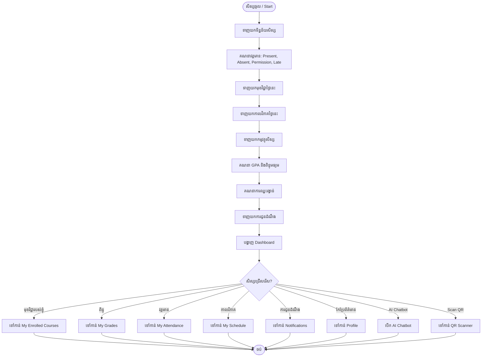
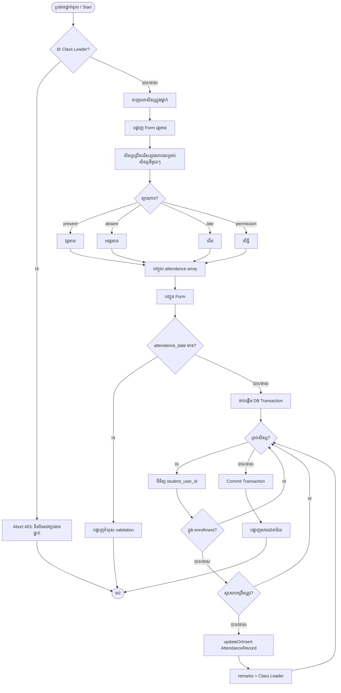
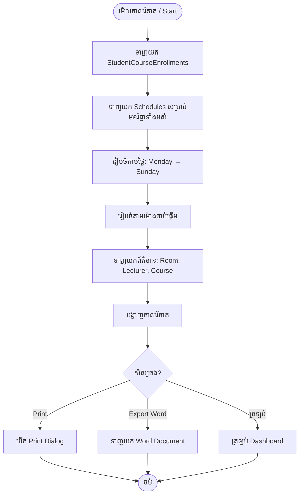
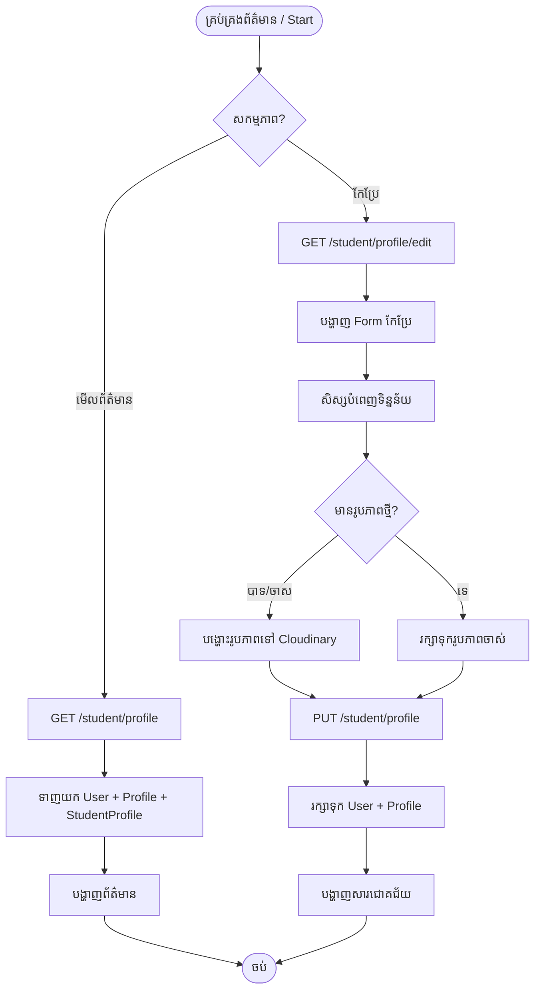
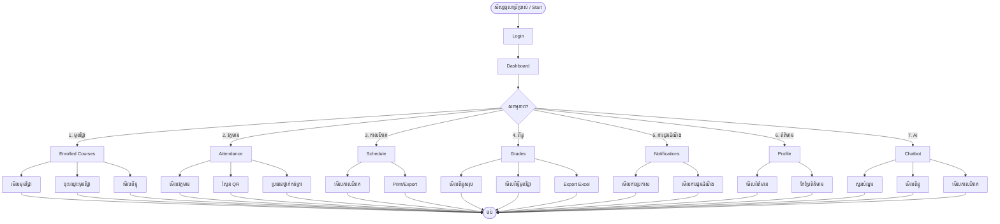

# Student Role - Flowchart Prompt

## រូបភាព៖ Process Flow សិស្ស

```
Create a comprehensive flowchart document for the STUDENT ROLE of a Class Management System at National Meanchey University. Use Mermaid flowchart syntax. Each flowchart should be numbered, have a Khmer title, and show decision points (diamonds), processes (rectangles), and start/end points (rounded). Use academic thesis style.

---

## FLOWCHART 1: Student Login Process

```mermaid
flowchart TD
    A([ចូលប្រើប្រាស់ / Start]) --> B{ជ្រើសរើសវិធីចូល?}
    B -->|Email + Password| C[បញ្ចូល Email និងពាក្យសម្ងាត់]
    B -->|Google OAuth| D[ចុច "ចូលជាមួយ Google"]
    B -->|QR Code| E[បង្ហាញ QR Code នៅ Desktop]
    
    C --> F{ពិនិត្យពាក្យសម្ងាត់?}
    F -->|ត្រឹមត្រូវ| G[ពិនិត្យតួនាទីអ្នកប្រើប្រាស់]
    F -->|មិនត្រឹមត្រូវ| H[បង្ហាញសារកំហុស]
    H --> C
    
    D --> I{Google Auth ជោគជ័យ?}
    I -->|បាទ/ចាស| G
    I -->|ទេ| J[បង្ហាញសារកំហុស]
    
    E --> K[សិស្សស្កែន QR ដោយទូរស័ព្ទ]
    K --> L{Token ត្រឹមត្រូវ?}
    L -->|បាទ/ចាស| M[Cache authorized_user]
    L -->|ទេ| N[បង្ហាញសារកំហុស]
    M --> O[Broadcast QrLoginSuccessful Event]
    O --> P[Desktop: finalizeLogin]
    P --> G
    
    G --> Q{តួនាធី?}
    Q -->|admin| R[រដ្ឋបាលសាលា Dashboard]
    Q -->|professor| S[គ្រូ Dashboard]
    Q -->|student| T[សិស្ស Dashboard]
    
    T --> U([ចប់ / End])
    R --> U
    S --> U
```

---

## FLOWCHART 2: Student Dashboard



---

## FLOWCHART 3: Course Enrollment Process

```mermaid
flowchart TD
    A([ចុះឈ្មោះមុខវិជ្ជា / Start]) --> B{ជ្រើសរើសវិធី?}
    
    B -->|ចុះឈ្មោះខ្លួនឯង| C[មើលមុខវិជ្ជាដែលមាន]
    C --> D[ជ្រើសរើសមុខវិជ្ជា]
    D --> E{រួចហើយឬ?}
    E -->|ទេ| F[បញ្ចូល course_offering_id]
    F --> G{មានឈ្មោះរួច?}
    G -->|ទេ| H[បង្កើត StudentCourseEnrollment]
    H --> I[បង្ហាញសារជោគជ័យ]
    G -->|បាទ/ចាស| J[បង្ហាញសារ "រួចហើយ"]
    E -->|បាទ/ចាស| K[បង្ហាញសារ "រួចហើយ"]
    
    B -->|ចុះឈ្មោះតាមកម្មវត្ថុ| L[មើលកម្មវត្ថុសិស្ស]
    L --> M[ជ្រើសរើសកម្មវត្ថុ]
    M --> N[ទាញយក CourseOffering សម្រាប់កម្មវត្ថុ]
    N --> O{មានមុខវិជ្ជាមិនទាន់ចុះឈ្មោះ?}
    O -->|បាទ/ចាស| P[ចុះឈ្មោះមុខវិជ្ជាទាំងអស់]
    P --> Q{រក្សាទុកជោគជ័យ?}
    Q -->|បាទ/ចាស| R[បង្ហាញ "ចុះឈ្មោះបាន X មុខវិជ្ជា"]
    Q -->|ទេ| S[បង្ហាញសារកំហុស]
    O -->|ទេ| T[បង្ហាញ "មិនមានមុខវិជ្ជាថ្មី"]
    
    I --> U([ចប់])
    J --> U
    K --> U
    R --> U
    S --> U
    T --> U
```

---

## FLOWCHART 4: QR Code Attendance (Student Scan)

```mermaid
flowchart TD
    A([សិស្សស្កែន QR / Start]) --> B[បើក Camera Scanner]
    B --> C{ស្កែន QR Code បាន?}
    C -->|ទេ| D[សូមស្កែនឡើងវិញ]
    D --> C
    
    C -->|បាទ/ចាស| E[ផ្ញើ token ទៅ server]
    E --> F{Token ត្រឹមត្រូវ?}
    F -->|ទេ| G[បង្ហាញ "QR Code មិនត្រឹមត្រូវ"]
    F -->|បាទ/ចាស| H{Token ផុតកំណត់?}
    H -->|បាទ/ចាស| I[បង្ហាញ "QR Code ផុតកំណត់"]
    H -->|ទេ| J{សិស្សមានឈ្មោះក្នុងថ្នាក់?}
    J -->|ទេ| K[បង្ហាញ "បងគ្មានឈ្មោះក្នុងថ្នាក់នេះ"]
    J -->|បាទ/ចាស| L{ស្កែនរួចរាល់ហើយ?}
    L -->|បាទ/ចាស| M[បង្ហាញ "បងបានស្កែនរួចរាល់ហើយ"]
    L -->|ទេ| N[បង្កើត AttendanceRecord]
    N --> O[status = present]
    O --> P[remarks = QR Scan]
    P --> Q[បង្ហាញ "វត្តមានត្រូវបានកត់ត្រា!"]
    
    G --> R([ចប់])
    I --> R
    K --> R
    M --> R
    Q --> R
```

---

## FLOWCHART 5: Class Leader Attendance



---

## FLOWCHART 6: Student View Grades

```mermaid
flowchart TD
    A([មើលពិន្ទុ / Start]) --> B[ទាញយក StudentCourseEnrollments]
    B --> C[ទាញយក ExamResults សម្រាប់មុខវិជ្ជាទាំងអស់]
    C --> D[ជ្រើសរើស Academic Year និង Semester]
    D --> E[-filter ពិន្ទុតាមឆ្នាំសិក្សា]
    E --> F{មានពិន្ទុ?}
    F -->|ទេ| G[បង្ហាញ "មិនទាន់មានពិន្ទុ"]
    F -->|បាទ/ចាស| H[គណនាពិន្ទុសម្រាប់មុខវិជ្ជានីមួយៗ]
    
    H --> I[ទាញយក Attendance Score]
    I --> J[បែងចែកពិន្ទុ: Assignment, Quiz, Exam]
    J --> K[គណនា Total Score]
    K --> L[ពិនិត្យ Failing Logic]
    L --> M{Final < 24 OR Midterm < 9 OR Assignment < 9 OR Attendance < 9?}
    M -->|បាទ/ចាស| N[Grade = F]
    M -->|ទេ| O[គណនា Letter Grade]
    
    N --> P[គណនា GPA]
    O --> P
    P --> Q[គណនាការឈ្នះរង្វាន់]
    Q --> R[បង្ហាញ ពិន្ទុសរុប, GPA, ឈ្មោះ, ចំណាត់ថ្នាក់]
    R --> S{សិស្សចង់មើល?}
    S -->|ពិន្ទុមុខវិជ្ជា| T[បង្ហាញពិន្ទីមុខវិជ្ជាលម្អិត]
    S -->|ការប្រឡង| U[បង្ហាញការប្រឡងទាំងអស់]
    S -->|Export| V[ទាញយក Excel]
    
    T --> W([ចប់])
    U --> W
    V --> W
    G --> W
```

---

## FLOWCHART 7: Student View Schedule



---

## FLOWCHART 8: Student Notifications

```mermaid
flowchart TD
    A([មើលការជូនដំណឹង / Start]) --> B[ទាញយក Announcements]
    B --> C[ទាញយក Notifications]
    C --> D[បញ្ចូលទិន្នន័យ]
    D --> E[រៀបចំតាមកាលបរិច្ឆេទថ្មីបំផុត]
    E --> F[បង្ហាញការជូនដំណឹង]
    F --> G{សិស្សជ្រើសរើស?}
    
    G -->|标记为已读| H[PATCH /notifications/{id}/read]
    H --> I[更新 read_at]
    I --> J[ត្រឡប់]
    
    G -->|标记 announcement ជា已读| K[PATCH /announcements/{id}/read]
    K --> L[បញ្ចូល NotificationRead]
    L --> J
    
    G -->|标记ទាំងអស់ជាបានអាន| M[PATCH /notifications/read-all]
    M --> N[ updateAll read_at = now]
    N --> J
    
    G -->|ត្រឡប់| J
    
    J --> O([ចប់])
```

---

## FLOWCHART 9: Student Profile Management



---

## FLOWCHART 10: AI Chatbot Interaction

```mermaid
flowchart TD
    A([សិស្សបើក Chatbot / Start]) --> B[បើក Chat Window]
    B --> C[សិស្សផ្ញើសារ]
    C --> D[ទាញយក User Profile: Gender]
    D --> E{Gender?}
    E -->|ប្រុស| F[ប្រើប្រាស់ "បងប្រុស"]
    E -->|ស្រី| G[ប្រើប្រាស់ "បងស្រី"]
    E -->|ទេ| H[ប្រើប្រាស់ "អ្នកសិក្សា"]
    
    F --> I[ទាញយក Enrolled Courses]
    G --> I
    H --> I
    
    I --> J[ទាញយក Grade Data]
    J --> K[ទាញយក Schedule Data]
    K --> L[បង្កើត Context String]
    L --> M[ផ្ញើសារទៅ AI API]
    M --> N{AI Response?}
    N -->|ជោគជ័យ| O[បង្ហាញចម្លើយ]
    N -->|កំហុស| P[បង្ហាញសារកំហុស]
    
    O --> Q{សិស្សចង់បន្ត?}
    Q -->|បាទ/ចាស| C
    Q -->|ទេ| R[បិទ Chat Window]
    
    R --> S([ចប់])
    P --> S
```

---

## FLOWCHART 11: Complete Student Process Overview



---

DESIGN NOTES:
- Use Mermaid flowchart syntax (```mermaid)
- Diamond shapes for decisions: {question?}
- Rounded shapes for start/end: ([text])
- Rectangles for processes: [text]
- Arrows show flow direction
- Number each flowchart
- Include both Khmer and English labels
- Academic thesis style
- Color coding: Green for start/end, Blue for processes, Yellow for decisions
```

## How to Use

1. Copy the prompt above
2. Paste into ChatGPT, Claude, or Gemini
3. Ask for Mermaid diagram output
4. Render at https://mermaid.live or embed in Markdown

## Files Analyzed

- `routes/web.php` — Student routes (lines 364-401)
- `app/Http/Controllers/Student/StudentController.php` — Dashboard, profile
- `app/Http/Controllers/Student/StudentGradeController.php` — Grades, enrollment, schedule
- `app/Http/Controllers/Student/StudentAttendanceController.php` — Attendance, leader
- `app/Http/Controllers/AttendanceController.php` — QR scan process
- `app/Http/Controllers/Auth/QrLoginController.php` — QR login
